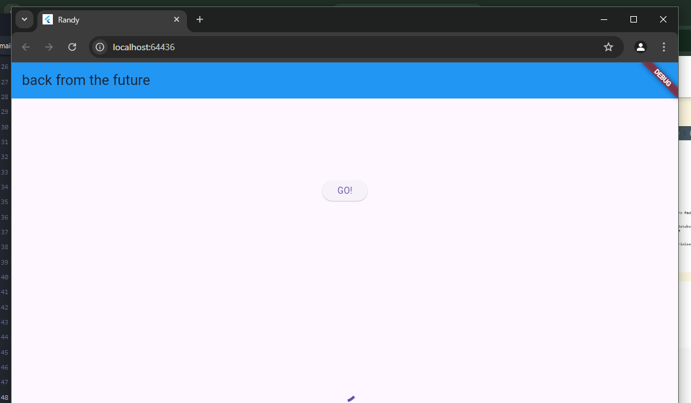
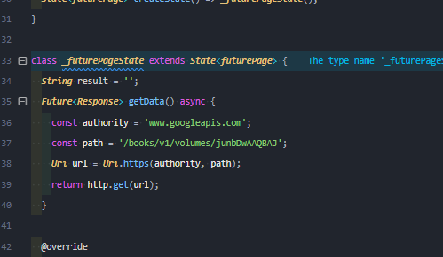
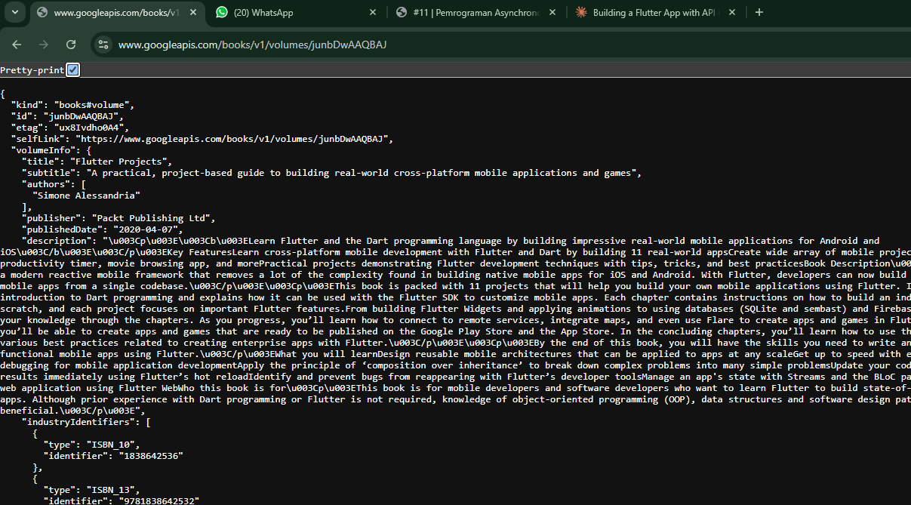
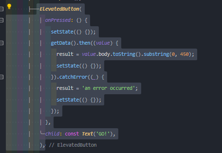
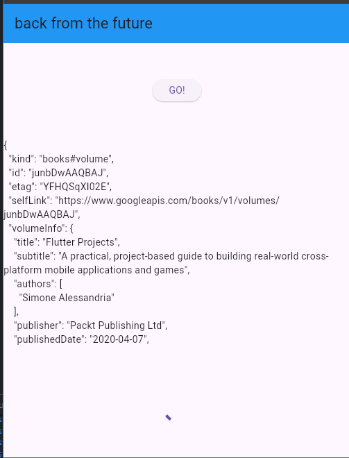
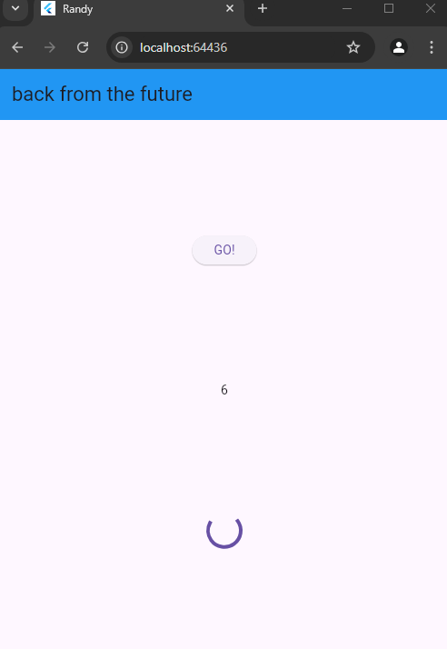

gambar di atas merupakan soal ke 1 yang menampilkan title di atas web nya

gambar di atas merupakan soal ke 2 yang menampilkan filter buku pada website googlelapis

penjelasan yang ada di atas ada di bawah yitu soal ke 3
catchError((_) {...}): Blok ini menangani kemungkinan kesalahan yang terjadi saat memanggil getData(). Jika terjadi kesalahan (misalnya, masalah jaringan atau kesalahan pada server), kode di dalam catchError akan dieksekusi.

.substring(0, 450): Metode substring digunakan untuk mengambil bagian dari string. Dalam hal ini, kita mengambil karakter dari indeks 0 hingga 450.

gambar di atas merupakan pratikum ke 4 

Fungsi count() adalah fungsi asinkron yang menjumlahkan hasil dari tiga fungsi: returnOneAsync, returnTwoAsync, dan returnThreeAsync. Ketiga fungsi ini dipanggil secara berurutan menggunakan await, sehingga total waktu eksekusinya adalah 9 detik (3 detik per fungsi). Setelah selesai, hasilnya diperbarui ke UI menggunakan setState().

Untuk mengoptimalkan waktu, ketiga fungsi bisa dijalankan bersamaan menggunakan Future.wait, sehingga total waktu hanya 3 detik tanpa mengubah hasil akhirnya.

