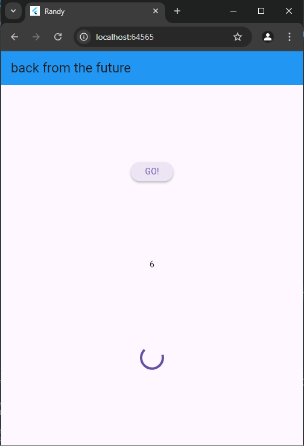

gambar di atas merupakan soal ke 1 yang menampilkan title di atas web nya

gambar di atas merupakan soal ke 2 yang menampilkan filter buku pada website googlelapis

penjelasan yang ada di atas ada di bawah yitu soal ke 3

catchError((_) {...}): Blok ini menangani kemungkinan kesalahan yang terjadi saat memanggil getData(). Jika terjadi kesalahan (misalnya, masalah jaringan atau kesalahan pada server), kode di dalam catchError akan dieksekusi.

.substring(0, 450): Metode substring digunakan untuk mengambil bagian dari string. Dalam hal ini, kita mengambil karakter dari indeks 0 hingga 450.

gambar di atas merupakan pratikum ke 4 

Fungsi count() adalah fungsi asinkron yang menjumlahkan hasil dari tiga fungsi: returnOneAsync, returnTwoAsync, dan returnThreeAsync. Ketiga fungsi ini dipanggil secara berurutan menggunakan await, sehingga total waktu eksekusinya adalah 9 detik (3 detik per fungsi). Setelah selesai, hasilnya diperbarui ke UI menggunakan setState().

Untuk mengoptimalkan waktu, ketiga fungsi bisa dijalankan bersamaan menggunakan Future.wait, sehingga total waktu hanya 3 detik tanpa mengubah hasil akhirnya.

gambar di atas merupakan praktikum ke 5
menginport pakage async .dart dan membuat tombol sudah di tekan maka angka yang muncul 42 dengan waktu 5 detik.

gambar di atas soal ke 6
Fungsi asinkron ini menunda eksekusi selama 5 detik menggunakan Future.delayed. Setelah itu, fungsi menyelesaikan Future dengan nilai 42 menggunakan completer.complete(42). Jika terjadi kesalahan, fungsi menangkap error dan menyelesaikan Future dengan completer.completeError({}), memungkinkan penanganan error di bagian lain kode.

soal ke 7
Kode di atas adalah sebuah fungsi Dart yang menggunakan konsep FutureGroup untuk menjalankan beberapa tugas secara asynchronous (tidak berurutan) dan kemudian menggabungkan hasilnya.

soal ke 8
langkah satu Membuat sebuah objek FutureGroup dengan tipe data generik int. Ini berarti FutureGroup ini akan menampung beberapa Future yang mengembalikan nilai bertipe int. 
langkah ke 4 membuat object untuk menjalankan beberapa tugas secara asinkron (tidak berurutan) dan kemudian mengumpulkan hasilnya.

soal ke 9
menampilkan pesan dari throw dengan somthing trible  happend